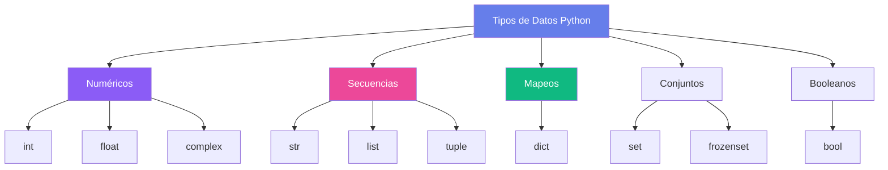

# Fundamentos de Python :fontawesome-brands-python:

Domina los conceptos básicos de Python con ejemplos interactivos y visualizaciones claras.

---

## :abc: Variables y Tipos de Datos

<div class="glass-card fade-in-up">

### Declaración de Variables

En Python, no necesitas declarar el tipo de una variable explícitamente:

```python linenums="1"
# Números enteros
edad = 25
año = 2026

# Números flotantes
precio = 19.99
pi = 3.14159

# Cadenas de texto
nombre = "Python"
mensaje = 'Hola Mundo'

# Booleanos
es_verdadero = True
es_falso = False

# None (equivalente a null)
valor_nulo = None
```

### Tipos de Datos Principales



</div>

---

## :package: Estructuras de Datos

### Listas (Arrays Dinámicos)

=== "Básico"

    ```python linenums="1"
    # Crear listas
    frutas = ["manzana", "banana", "naranja"]
    numeros = [1, 2, 3, 4, 5]
    mixta = [1, "dos", 3.0, True]
    
    # Acceder a elementos
    print(frutas[0])      # manzana
    print(frutas[-1])     # naranja (último elemento)
    
    # Modificar elementos
    frutas[1] = "pera"
    print(frutas)         # ['manzana', 'pera', 'naranja']
    ```

=== "Métodos Útiles"

    ```python linenums="1"
    lista = [1, 2, 3]
    
    # Agregar elementos
    lista.append(4)           # [1, 2, 3, 4]
    lista.insert(0, 0)        # [0, 1, 2, 3, 4]
    lista.extend([5, 6])      # [0, 1, 2, 3, 4, 5, 6]
    
    # Eliminar elementos
    lista.remove(0)           # Elimina el primer 0
    ultimo = lista.pop()      # Elimina y retorna el último
    
    # Otros métodos
    lista.reverse()           # Invierte la lista
    lista.sort()              # Ordena la lista
    print(len(lista))         # Longitud
    ```

=== "List Comprehension"

    ```python linenums="1" hl_lines="2 5 8"
    # Crear lista de cuadrados
    cuadrados = [x**2 for x in range(10)]
    # [0, 1, 4, 9, 16, 25, 36, 49, 64, 81]
    
    # Con condición
    pares = [x for x in range(20) if x % 2 == 0]
    
    # Anidados
    matriz = [[i*j for j in range(3)] for i in range(3)]
    # [[0, 0, 0], [0, 1, 2], [0, 2, 4]]
    ```

### Diccionarios (Hash Maps)

=== "Básico"

    ```python linenums="1"
    # Crear diccionario
    persona = {
        "nombre": "Ana",
        "edad": 28,
        "ciudad": "Madrid",
        "profesion": "Developer"
    }
    
    # Acceder a valores
    print(persona["nombre"])           # Ana
    print(persona.get("edad"))         # 28
    print(persona.get("pais", "N/A"))  # N/A (valor por defecto)
    
    # Modificar valores
    persona["edad"] = 29
    persona["email"] = "ana@example.com"
    ```

=== "Métodos Avanzados"

    ```python linenums="1"
    persona = {"nombre": "Carlos", "edad": 30}
    
    # Obtener claves y valores
    claves = persona.keys()       # dict_keys(['nombre', 'edad'])
    valores = persona.values()    # dict_values(['Carlos', 30])
    items = persona.items()       # Pares clave-valor
    
    # Actualizar diccionario
    persona.update({"ciudad": "Barcelona", "edad": 31})
    
    # Eliminar elementos
    edad = persona.pop("edad")
    
    # Dict comprehension
    cuadrados = {x: x**2 for x in range(5)}
    # {0: 0, 1: 1, 2: 4, 3: 9, 4: 16}
    ```

---

## :arrows_counterclockwise: Control de Flujo

### Condicionales

<div class="features-grid">

<div class="glass-card">

#### If/Elif/Else

```python linenums="1"
edad = 18

if edad < 18:
    print("Menor de edad")
elif edad == 18:
    print("Acabas de ser mayor!")
else:
    print("Mayor de edad")
```

</div>

<div class="glass-card">

#### Operador Ternario

```python linenums="1"
edad = 20

# Forma compacta
estado = "Mayor" if edad >= 18 else "Menor"

# Equivalente a:
if edad >= 18:
    estado = "Mayor"
else:
    estado = "Menor"
```

</div>

</div>

### Bucles

=== "For Loop"

    ```python linenums="1"
    # Iterar sobre lista
    frutas = ["manzana", "banana", "cereza"]
    for fruta in frutas:
        print(fruta)
    
    # Iterar con índice
    for i, fruta in enumerate(frutas):
        print(f"{i}: {fruta}")
    
    # Range
    for i in range(5):
        print(i)  # 0, 1, 2, 3, 4
    
    # Range con inicio y fin
    for i in range(2, 7):
        print(i)  # 2, 3, 4, 5, 6
    
    # Range con paso
    for i in range(0, 10, 2):
        print(i)  # 0, 2, 4, 6, 8
    ```

=== "While Loop"

    ```python linenums="1"
    # While básico
    contador = 0
    while contador < 5:
        print(contador)
        contador += 1
    
    # While con break
    while True:
        respuesta = input("Escribe 'salir': ")
        if respuesta == "salir":
            break
    
    # While con continue
    num = 0
    while num < 10:
        num += 1
        if num % 2 == 0:
            continue  # Salta pares
        print(num)  # Solo imprime impares
    ```

=== "Comprehensions"

    ```python linenums="1"
    # List comprehension con if
    pares = [x for x in range(10) if x % 2 == 0]
    
    # Dict comprehension
    cuadrados = {x: x**2 for x in range(5)}
    
    # Set comprehension
    unicos = {x % 3 for x in range(20)}
    
    # Generator expression (más eficiente)
    gen = (x**2 for x in range(1000000))
    ```

---

## :gear: Funciones

### Definición Básica

```python linenums="1" hl_lines="1 9"
def saludar(nombre, saludo="Hola"):
    """
    Saluda a una persona.
    
    Args:
        nombre (str): Nombre de la persona
        saludo (str): Tipo de saludo (default: "Hola")
    
    Returns:
        str: Mensaje de saludo
    """
    return f"{saludo}, {nombre}!"

# Uso
print(saludar("Ana"))                    # Hola, Ana!
print(saludar("Carlos", "Buenos días"))  # Buenos días, Carlos!
```

### Args y Kwargs

=== "*args (Argumentos Variables)"

    ```python linenums="1"
    def sumar(*args):
        """Suma cualquier cantidad de números."""
        total = 0
        for num in args:
            total += num
        return total
    
    print(sumar(1, 2, 3))           # 6
    print(sumar(1, 2, 3, 4, 5))     # 15
    ```

=== "**kwargs (Argumentos Nombrados)"

    ```python linenums="1"
    def crear_perfil(**kwargs):
        """Crea un perfil con información variable."""
        perfil = {}
        for clave, valor in kwargs.items():
            perfil[clave] = valor
        return perfil
    
    usuario = crear_perfil(
        nombre="Ana",
        edad=25,
        ciudad="Madrid",
        profesion="Developer"
    )
    print(usuario)
    ```

=== "Combinado"

    ```python linenums="1"
    def funcion_completa(requerido, *args, **kwargs):
        """Acepta todo tipo de argumentos."""
        print(f"Requerido: {requerido}")
        print(f"Args: {args}")
        print(f"Kwargs: {kwargs}")
    
    funcion_completa(
        "obligatorio",
        1, 2, 3,
        nombre="Python",
        version=3.12
    )
    ```

---

## :package: Módulos e Importaciones

### Importar Módulos

```python linenums="1"
# Importar módulo completo
import math
print(math.pi)        # 3.141592653589793
print(math.sqrt(16))  # 4.0

# Importar específico
from math import pi, sqrt
print(pi)
print(sqrt(25))

# Importar con alias
import pandas as pd
import numpy as np

# Importar todo (no recomendado)
from math import *
```

### Crear tu Propio Módulo

=== "mi_modulo.py"

    ```python linenums="1"
    """Mi módulo personalizado."""
    
    def saludar(nombre):
        return f"¡Hola, {nombre}!"
    
    def despedir(nombre):
        return f"¡Adiós, {nombre}!"
    
    PI = 3.14159
    ```

=== "main.py"

    ```python linenums="1"
    import mi_modulo
    
    print(mi_modulo.saludar("Python"))
    print(mi_modulo.PI)
    
    # O con alias
    import mi_modulo as mm
    print(mm.despedir("Mundo"))
    ```

---

## :memo: Ejercicios Prácticos

??? example "Ejercicio 1: FizzBuzz"
    Imprime los números del 1 al 100, pero:
    - Para múltiplos de 3: imprime "Fizz"
    - Para múltiplos de 5: imprime "Buzz"
    - Para múltiplos de ambos: imprime "FizzBuzz"
    
    ??? check "Solución"
        ```python linenums="1"
        for i in range(1, 101):
            if i % 15 == 0:
                print("FizzBuzz")
            elif i % 3 == 0:
                print("Fizz")
            elif i % 5 == 0:
                print("Buzz")
            else:
                print(i)
        ```

??? example "Ejercicio 2: Palíndromo"
    Crear una función que determine si una palabra es palíndromo.
    
    ??? check "Solución"
        ```python linenums="1"
        def es_palindromo(palabra):
            """Verifica si una palabra es palíndromo."""
            palabra = palabra.lower().replace(" ", "")
            return palabra == palabra[::-1]
        
        # Pruebas
        print(es_palindromo("reconocer"))  # True
        print(es_palindromo("python"))     # False
        print(es_palindromo("anita lava la tina"))  # True
        ```

??? example "Ejercicio 3: Contador de Palabras"
    Contar la frecuencia de cada palabra en un texto.
    
    ??? check "Solución"
        ```python linenums="1"
        def contar_palabras(texto):
            """Cuenta la frecuencia de palabras."""
            palabras = texto.lower().split()
            frecuencia = {}
            
            for palabra in palabras:
                frecuencia[palabra] = frecuencia.get(palabra, 0) + 1
            
            return frecuencia
        
        texto = "python es genial python es poderoso"
        print(contar_palabras(texto))
        # {'python': 2, 'es': 2, 'genial': 1, 'poderoso': 1}
        ```

---

!!! success "¡Felicitaciones! :tada:"
    Has completado los fundamentos de Python. Ahora estás listo para [conceptos avanzados](avanzado.md)!

<div class="text-center py-2xl">
  <a href="avanzado/" class="btn-premium btn-primary">Siguiente: Temas Avanzados :arrow_right:</a>
</div>
