# Bienvenido a Python Wiki Premium :fontawesome-brands-python:

<div class="hero-section fade-in-up">
  <h1 class="hero-title">
    <span class="gradient-text">Aprende Python</span><br>
    de forma Moderna e Interactiva
  </h1>
  <p class="hero-subtitle">
    Documentación profesional con ejemplos interactivos, diagramas animados y diseño premium
  </p>
  <div class="hero-cta">
    <a href="#primeros-pasos" class="btn-premium btn-primary">
      :rocket: Comenzar Ahora
    </a>
    <a href="fundamentos/" class="btn-premium btn-secondary">
      :books: Ver Fundamentos
    </a>
  </div>
</div>

---

## :sparkles: Características Destacadas

<div class="features-grid fade-in-up">
  <div class="feature-card">
    <div class="feature-icon">:zap:</div>
    <h3 class="feature-title">Rápido y Moderno</h3>
    <p>Navegación instantánea y diseño responsivo con las últimas tecnologías web</p>
  </div>
  
  <div class="feature-card">
    <div class="feature-icon">:art:</div>
    <h3 class="feature-title">Diseño Premium</h3>
    <p>Glassmorphism, animaciones suaves y efectos visuales impresionantes</p>
  </div>
  
  <div class="feature-card">
    <div class="feature-icon">:bulb:</div>
    <h3 class="feature-title">Ejemplos Interactivos</h3>
    <p>Aprende con ejemplos de código en múltiples lenguajes y diagramas animados</p>
  </div>
</div>

---

## :bar_chart: Python en Números

<div class="stats-grid fade-in">
  <div class="stat-card scale-in">
    <span class="stat-number" data-count="100">0</span>
    <span class="stat-label">Ejemplos de Código</span>
  </div>
  
  <div class="stat-card scale-in stagger-1">
    <span class="stat-number" data-count="50">0</span>
    <span class="stat-label">Diagramas</span>
  </div>
  
  <div class="stat-card scale-in stagger-2">
    <span class="stat-number" data-count="30">0</span>
    <span class="stat-label">Ejercicios</span>
  </div>
  
  <div class="stat-card scale-in stagger-3">
    <span class="stat-number" data-count="10">0</span>
    <span class="stat-label">Proyectos</span>
  </div>
</div>

---

## :fire: Primeros Pasos

### 1. Pestañas de Código Interactivas

Compara la misma funcionalidad en diferentes lenguajes:

=== "Python :fontawesome-brands-python:"

    ```python title="saludos.py" linenums="1" hl_lines="3"
    def saludar(nombre):
        """Función que saluda al usuario."""
        return f"¡Hola, {nombre}! 👋"

    # Uso
    mensaje = saludar("Mundo")
    print(mensaje)  # Output: ¡Hola, Mundo! 👋
    ```

=== "JavaScript :fontawesome-brands-js:"

    ```javascript title="saludos.js" linenums="1" hl_lines="3"
    function saludar(nombre) {
      // Función que saluda al usuario
      return `¡Hola, ${nombre}! 👋`;
    }

    // Uso
    const mensaje = saludar("Mundo");
    console.log(mensaje); // Output: ¡Hola, Mundo! 👋
    ```

=== "C++ :material-language-cpp:"

    ```cpp title="saludos.cpp" linenums="1" hl_lines="6"
    #include <iostream>
    #include <string>
    using namespace std;

    string saludar(string nombre) {
        return "¡Hola, " + nombre + "! 👋";
    }

    int main() {
        string mensaje = saludar("Mundo");
        cout << mensaje << endl;  // Output: ¡Hola, Mundo! 👋
        return 0;
    }
    ```

=== "Rust :fontawesome-solid-gear:"

    ```rust title="saludos.rs" linenums="1" hl_lines="2"
    fn saludar(nombre: &str) -> String {
        format!("¡Hola, {}! 👋", nombre)
    }

    fn main() {
        let mensaje = saludar("Mundo");
        println!("{}", mensaje);  // Output: ¡Hola, Mundo! 👋
    }
    ```

---

### 2. Bloques Colapsables con Ejercicios

??? success "Ejercicio 1: Tipos de Datos"
    **Pregunta:** ¿Cuál es la salida de `print(3 * '7')`?
    
    ??? tip "Pista"
        En Python, multiplicar un string por un número repite el string.
    
    ??? check "Solución"
        ```python
        print(3 * '7')  # Output: 777
        ```
        
        El operador `*` repite el string `'7'` tres veces, resultando en `'777'`.

??? example "Ejercicio 2: Comprensión de Listas"
    **Desafío:** Crear una lista de cuadrados del 1 al 10 usando list comprehension.
    
    ??? check "Solución"
        ```python
        cuadrados = [x**2 for x in range(1, 11)]
        print(cuadrados)
        # Output: [1, 4, 9, 16, 25, 36, 49, 64, 81, 100]
        ```

---

### 3. Cajas de Alerta Profesionales

!!! tip "Consejo Pro :trophy:"
    Usa **entornos virtuales** (`venv`) para aislar las dependencias de cada proyecto:
    
    ```bash
    python -m venv mi_entorno
    # Windows
    mi_entorno\Scripts\activate
    # Linux/Mac
    source mi_entorno/bin/activate
    ```

!!! warning "Cuidado con la Indentación :warning:"
    Python es **estricto con los espacios**. Un error común:
    
    ```python
    def mi_funcion():
    print("Error!")  # ❌ IndentationError
    ```
    
    Correcto:
    
    ```python
    def mi_funcion():
        print("Correcto!")  # ✅
    ```

!!! danger "Zona Peligrosa :fire:"
    Nunca hagas esto en producción:
    
    ```python
    import os
    os.system("rm -rf /")  # ⚠️ NUNCA ejecutes esto
    ```

!!! info "Sabías que... :bulb:"
    Python fue creado por **Guido van Rossum** y lanzado en 1991. El nombre viene de *Monty Python*, no de la serpiente.

---

### 4. Diagramas Interactivos con Mermaid

#### Flujo de Desarrollo Python

```mermaid
graph TB
    A[Inicio] --> B{¿Python Instalado?}
    B -->|Sí| C[Crear Proyecto]
    B -->|No| D[Instalar Python]
    D --> C
    C --> E[Crear Entorno Virtual]
    E --> F[Instalar Dependencias]
    F --> G[Escribir Código]
    G --> H[Ejecutar Script]
    H --> I{¿Funciona?}
    I -->|Sí| J[Celebrar 🎉]
    I -->|No| K[Debuggear 🐛]
    K --> L{¿Error Conocido?}
    L -->|Sí| G
    L -->|No| M[Stack Overflow]
    M --> G
    J --> N[Commit & Push]
    N --> O[Fin]
    
    style A fill:#667eea,color:#fff
    style O fill:#10b981,color:#fff
    style J fill:#10b981,color:#fff
    style K fill:#ef4444,color:#fff
    style M fill:#f59e0b,color:#fff
```



#### Arquitectura de una Aplicación Python


---

### 5. Atajos de Teclado

Aprende los shortcuts más útiles:

- ++ctrl+c++ : Copiar texto seleccionado
- ++ctrl+v++ : Pegar
- ++ctrl+shift+p++ : Paleta de comandos (VS Code)
- ++f5++ : Ejecutar/Depurar en IDE
- ++ctrl+slash++ : Comentar/Descomentar línea
- ++alt+shift+f++ : Formatear documento

---

### 6. Lista de Tareas Interactiva

Progreso de aprendizaje:

- [x] Instalar Python
- [x] Configurar entorno virtual
- [ ] Aprender sintaxis básica
- [ ] Dominar estructuras de datos
- [ ] Crear primer proyecto
- [ ] Contribuir a Open Source

---

## :rocket: Empecemos tu Viaje

<div class="features-grid">
  <div class="glass-card hover-lift">
    <h3>:beginner: Principiantes</h3>
    <p>Comienza desde cero con nuestros tutoriales paso a paso</p>
    <a href="fundamentos/" class="btn-premium btn-primary" style="margin-top: 1rem;">Ir a Fundamentos →</a>
  </div>
  
  <div class="glass-card hover-lift">
    <h3>:mortar_board: Avanzados</h3>
    <p>Profundiza en decoradores, generators y async/await</p>
    <a href="avanzado/" class="btn-premium btn-primary" style="margin-top: 1rem;">Temas Avanzados →</a>
  </div>
  
  <div class="glass-card hover-lift">
    <h3>:wrench: Proyectos</h3>
    <p>Aplica tus conocimientos en proyectos reales</p>
    <a href="proyectos/" class="btn-premium btn-primary" style="margin-top: 1rem;">Ver Proyectos →</a>
  </div>
</div>

---

## :link: Enlaces Rápidos

<div class="features-grid">
  <div class="feature-card">
    <h4>:books:Documentación Oficial</h4>
    <p><a href="https://docs.python.org/es/" target="_blank">Python Docs</a></p>
  </div>
  
  <div class="feature-card">
    <h4>:package: Paquetes</h4>
    <p><a href="https://pypi.org/" target="_blank">PyPI Repository</a></p>
  </div>
  
  <div class="feature-card">
    <h4>:newspaper: Noticias</h4>
    <p><a href="https://realpython.com/" target="_blank">Real Python</a></p>
  </div>
</div>

---

!!! quote "Cita Inspiradora :star:"
    > "Python es un lenguaje de programación que te permite trabajar más rápido e integrar tus sistemas de manera más efectiva."
    > 
    > — **Guido van Rossum**, Creador de Python

---

<p class="text-center gradient-text" style="font-size: 1.5rem; font-weight: 700; margin-top: 3rem;">
¡Feliz Coding! :heart:
</p>