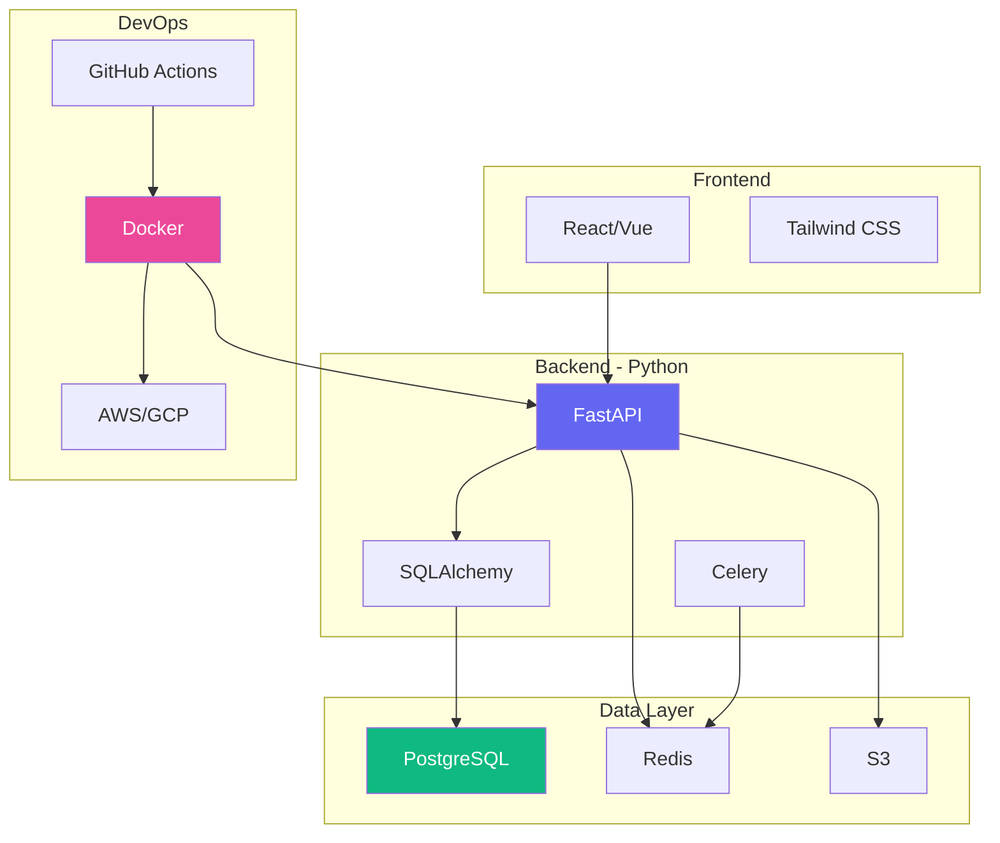

# Proyectos Python :wrench:

Aplica tus conocimientos con proyectos prácticos y desafiantes.

---

## :beginner: Proyectos para Principiantes

<div class="features-grid fade-in-up">

<div class="glass-card">

### 1. Calculadora CLI
**Dificultad:** ⭐☆☆☆☆

Crea una calculadora de línea de comandos con operaciones básicas.

```python
def calculadora():
    print("=== Calculadora ===")
    num1 = float(input("Primer número: "))
    operador = input("Operación (+,-,*,/): ")
    num2 = float(input("Segundo número: "))
    
    if operador == '+':
        print(f"Resultado: {num1 + num2}")
    elif operador == '-':
        print(f"Resultado: {num1 - num2}")
    elif operador == '*':
        print(f"Resultado: {num1 * num2}")
    elif operador == '/' and num2 != 0:
        print(f"Resultado: {num1 / num2}")
    else:
        print("Operación no válida")
```

**Mejoras posibles:**
- [ ] Historial de operaciones
- [ ] Funciones científicas
- [ ] Interfaz gráfica con Tkinter

</div>

<div class="glass-card">

### 2. To-Do List
**Dificultad:** ⭐⭐☆☆☆

Sistema simple para gestionar tareas.

```python
import json

class TodoList:
    def __init__(self):
        self.tareas = []
    
    def agregar(self, tarea):
        self.tareas.append({
            'descripcion': tarea,
            'completada': False
        })
    
    def completar(self, indice):
        if 0 <= indice < len(self.tareas):
            self.tareas[indice]['completada'] = True
    
    def mostrar(self):
        for i, tarea in enumerate(self.tareas):
            estado = "✅" if tarea['completada'] else "❌"
            print(f"{i}. {estado} {tarea['descripcion']}")
    
    def guardar(self, archivo='tareas.json'):
        with open(archivo, 'w') as f:
            json.dump(self.tareas, f, indent=2)
```

**Features adicionales:**
- [ ] Prioridades
- [ ] Fechas límite
- [ ] Categorías

</div>

<div class="glass-card">

### 3. Generador de Contraseñas
**Dificultad:** ⭐☆☆☆☆

Genera contraseñas seguras aleatorias.

```python
import random
import string

def generar_password(longitud=12, incluir_simbolos=True):
    caracteres = string.ascii_letters + string.digits
    if incluir_simbolos:
        caracteres += string.punctuation
    
    password = ''.join(random.choice(caracteres) 
                      for _ in range(longitud))
    return password

# Versión avanzada con validación
def password_seguro(longitud=16):
    while True:
        password = ''.join(
            random.choice(string.ascii_letters + 
                         string.digits + 
                         string.punctuation)
            for _ in range(longitud)
        )
        
        # Validar requisitos
        tiene_mayuscula = any(c.isupper() for c in password)
        tiene_minuscula = any(c.islower() for c in password)
        tiene_numero = any(c.isdigit() for c in password)
        tiene_simbolo = any(c in string.punctuation for c in password)
        
        if all([tiene_mayuscula, tiene_minuscula, 
                tiene_numero, tiene_simbolo]):
            return password
```

</div>

</div>

---

## :mortar_board: Proyectos Intermedios

<div class="features-grid">

<div class="glass-card">

### 4. Web Scraper
**Dificultad:** ⭐⭐⭐☆☆

Extrae información de sitios web.

```python
import requests
from bs4 import BeautifulSoup

class WebScraper:
    def __init__(self, url):
        self.url = url
        self.soup = None
    
    def obtener_html(self):
        response = requests.get(self.url)
        self.soup = BeautifulSoup(response.content, 'html.parser')
    
    def extraer_titulos(self):
        if not self.soup:
            self.obtener_html()
        return [h2.text for h2 in self.soup.find_all('h2')]
    
    def extraer_links(self):
        if not self.soup:
            self.obtener_html()
        return [a['href'] for a in self.soup.find_all('a', href=True)]
    
    def guardar_datos(self, datos, archivo):
        with open(archivo, 'w', encoding='utf-8') as f:
            for item in datos:
                f.write(f"{item}\n")
```

**Tecnologías:**
- `requests` - HTTP requests
- `BeautifulSoup4` - HTML parsing
- `Selenium` - Navegación con JavaScript

</div>

<div class="glass-card">

### 5. API REST con Flask
**Dificultad:** ⭐⭐⭐☆☆

Crea una API REST simple.

```python
from flask import Flask, jsonify, request

app = Flask(__name__)

# Base de datos en memoria
users = [
    {'id': 1, 'name': 'Ana', 'email': 'ana@example.com'},
    {'id': 2, 'name': 'Carlos', 'email': 'carlos@example.com'}
]

@app.route('/api/users', methods=['GET'])
def get_users():
    return jsonify(users)

@app.route('/api/users/<int:user_id>', methods=['GET'])
def get_user(user_id):
    user = next((u for u in users if u['id'] == user_id), None)
    return jsonify(user) if user else ('Not found', 404)

@app.route('/api/users', methods=['POST'])
def create_user():
    new_user = request.json
    new_user['id'] = len(users) + 1
    users.append(new_user)
    return jsonify(new_user), 201

if __name__ == '__main__':
    app.run(debug=True)
```

**Endpoints:**
- `GET /api/users` - Listar usuarios
- `GET /api/users/<id>` - Usuario específico
- `POST /api/users` - Crear usuario

</div>

<div class="glass-card">

### 6. Bot de Telegram
**Dificultad:** ⭐⭐⭐☆☆

Bot interactivo para Telegram.

```python
from telegram import Update
from telegram.ext import Updater, CommandHandler, MessageHandler, Filters

def start(update, context):
    update.message.reply_text('¡Hola! Soy tu bot de Python')

def echo(update, context):
    update.message.reply_text(update.message.text)

def help_command(update, context):
    update.message.reply_text(
        '/start - Iniciar bot\n'
        '/help - Ver ayuda\n'
        '/info - Información del bot'
    )

def main():
    updater = Updater("TU_TOKEN_AQUI", use_context=True)
    dp = updater.dispatcher
    
    dp.add_handler(CommandHandler("start", start))
    dp.add_handler(CommandHandler("help", help_command))
    dp.add_handler(MessageHandler(Filters.text & ~Filters.command, echo))
    
    updater.start_polling()
    updater.idle()
```

</div>

</div>

---

## :fire: Proyectos Avanzados

<div class="features-grid">

<div class="glass-card">

### 7. Machine Learning - Clasificador
**Dificultad:** ⭐⭐⭐⭐☆

Clasificador de imágenes con TensorFlow.

```python
import tensorflow as tf
from tensorflow import keras
import numpy as np

# Cargar dataset
(x_train, y_train), (x_test, y_test) = keras.datasets.mnist.load_data()

# Normalizar
x_train = x_train / 255.0
x_test = x_test / 255.0

# Crear modelo
model = keras.Sequential([
    keras.layers.Flatten(input_shape=(28, 28)),
    keras.layers.Dense(128, activation='relu'),
    keras.layers.Dropout(0.2),
    keras.layers.Dense(10, activation='softmax')
])

# Compilar
model.compile(
    optimizer='adam',
    loss='sparse_categorical_crossentropy',
    metrics=['accuracy']
)

# Entrenar
model.fit(x_train, y_train, epochs=5, validation_split=0.2)

# Evaluar
test_loss, test_acc = model.evaluate(x_test, y_test)
print(f'Precisión: {test_acc*100:.2f}%')
```

</div>

<div class="glass-card">

### 8. Dashboard con Streamlit
**Dificultad:** ⭐⭐⭐⭐☆

Dashboard interactivo para análisis de datos.

```python
import streamlit as st
import pandas as pd
import plotly.express as px

st.set_page_config(page_title="Dashboard", layout="wide")

st.title("📊 Dashboard de Análisis")

# Cargar datos
@st.cache_data
def load_data():
    df = pd.read_csv('data.csv')
    return df

df = load_data()

# Sidebar
st.sidebar.header("Filtros")
year = st.sidebar.slider("Año", 2020, 2025, 2023)

# Métricas
col1, col2, col3 = st.columns(3)
col1.metric("Total Ventas", "1.2M€", "+15%")
col2.metric("Usuarios", "250K", "+8%")
col3.metric("Conversión", "3.5%", "-0.2%")

# Gráficos
fig = px.line(df, x='fecha', y='ventas', title='Ventas por Mes')
st.plotly_chart(fig, use_container_width=True)

# Tabla
st.dataframe(df, use_container_width=True)
```

</div>

<div class="glass-card">

### 9. Blockchain Simple
**Dificultad:** ⭐⭐⭐⭐⭐

Implementación básica de blockchain.

```python
import hashlib
import json
from time import time

class Blockchain:
    def __init__(self):
        self.chain = []
        self.current_transactions = []
        # Crear bloque génesis
        self.new_block(previous_hash='1', proof=100)
    
    def new_block(self, proof, previous_hash=None):
        block = {
            'index': len(self.chain) + 1,
            'timestamp': time(),
            'transactions': self.current_transactions,
            'proof': proof,
            'previous_hash': previous_hash or self.hash(self.chain[-1]),
        }
        self.current_transactions = []
        self.chain.append(block)
        return block
    
    def new_transaction(self, sender, recipient, amount):
        self.current_transactions.append({
            'sender': sender,
            'recipient': recipient,
            'amount': amount,
        })
        return self.last_block['index'] + 1
    
    @staticmethod
    def hash(block):
        block_string = json.dumps(block, sort_keys=True).encode()
        return hashlib.sha256(block_string).hexdigest()
    
    @property
    def last_block(self):
        return self.chain[-1]
```

</div>

</div>

---

## :rocket: Arquitectura de Proyecto Profesional



---

## :books: Recursos para Proyectos

<div class="features-grid">

<div class="feature-card">

### Librerías Populares

- **Web**: Flask, Django, FastAPI
- **Data Science**: Pandas, NumPy, Matplotlib
- **ML**: TensorFlow, PyTorch, scikit-learn
- **Scraping**: BeautifulSoup, Scrapy, Selenium
- **Testing**: pytest, unittest

</div>

<div class="feature-card">

### Herramientas

- **IDE**: VS Code, PyCharm
- **Versionado**: Git, GitHub
- **CI/CD**: GitHub Actions, Jenkins
- **Contenedores**: Docker, Kubernetes
- **Cloud**: AWS, GCP, Azure

</div>

<div class="feature-card">

### Best Practices

- ✅ Usar entornos virtuales
- ✅ Escribir tests
- ✅ Documentar código
- ✅ Seguir PEP 8
- ✅ Code reviews
- ✅ Control de versiones

</div>

</div>

---

!!! success "¿Listo para Empezar? :rocket:"
    Elige un proyecto acorde a tu nivel y comienza a codear. ¡La práctica hace al maestro!

<div class="text-center py-2xl">
  <a href="../recursos/" class="btn-premium btn-primary">Ver Recursos →</a>
</div>
