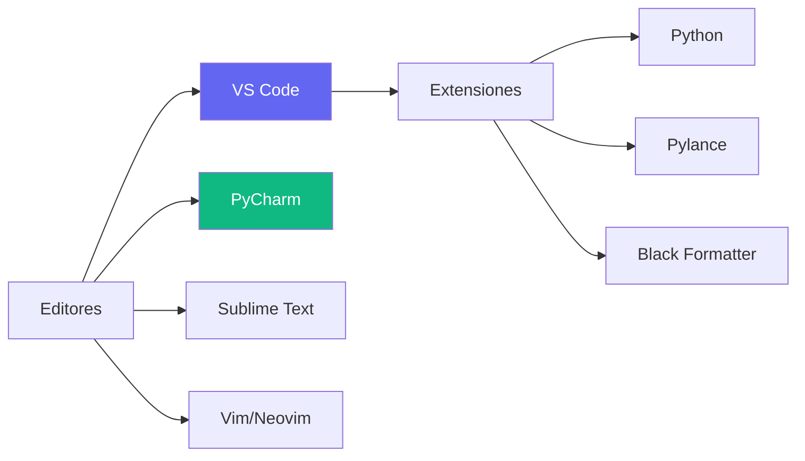
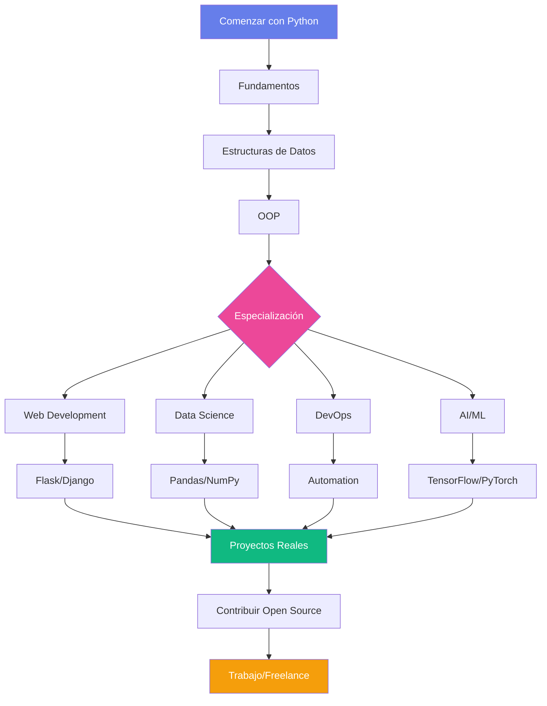

# Recursos de Python :books:

Colección curada de recursos para continuar aprendiendo Python.

---

## :globe_with_meridians: Documentación Oficial

<div class="glass-card fade-in-up">

### Python.org

- **[Documentación Oficial](https://docs.python.org/es/)** - Referencia completa en español
- **[Tutorial](https://docs.python.org/es/3/tutorial/)** - Tutorial oficial para principiantes
- **[PEP Index](https://www.python.org/dev/peps/)** - Python Enhancement Proposals
- **[PyPI](https://pypi.org/)** - Python Package Index

</div>

---

## :mortar_board: Cursos y Tutoriales

<div class="features-grid">

<div class="glass-card">

### Gratis

- **[Real Python](https://realpython.com/)** - Tutoriales y artículos de calidad
- **[freeCodeCamp](https://www.freecodecamp.org/)** - Curso completo gratuito
- **[Codecademy Python](https://www.codecademy.com/learn/learn-python-3)** - Interactivo
- **[Python para Todos](https://www.py4e.com/)** - Universidad de Michigan

</div>

<div class="glass-card">

### De Pago

- **[Udemy](https://www.udemy.com/)** - Variedad de cursos
- **[Coursera](https://www.coursera.org/)** - Cursos universitarios
- **[Platzi](https://platzi.com/)** - En español
- **[LinkedIn Learning](https://www.linkedin.com/learning/)** - Profesional

</div>

<div class="glass-card">

### YouTube

- **[Corey Schafer](https://www.youtube.com/c/Coreyms)** - Tutorials excelentes
- **[Tech With Tim](https://www.youtube.com/c/TechWithTim)** - Proyectos prácticos
- **[Programación ATS](https://www.youtube.com/@ProgramacionATS)** - En español
- **[MoureDev](https://www.youtube.com/@mouredev)** - Contenido variado

</div>

</div>

---

## :package: Librerías Esenciales

### Web Development

=== "Frameworks"

    | Librería | Descripción | Dificultad |
    |----------|-------------|------------|
    | **Flask** | Microframework minimalista | ⭐⭐☆☆☆ |
    | **Django** | Framework full-stack | ⭐⭐⭐☆☆ |
    | **FastAPI** | API moderno y rápido | ⭐⭐⭐☆☆ |
    | **Streamlit** | Apps de datos rápidas | ⭐⭐☆☆☆ |

=== "Enlaces"

    - [Flask Docs](https://flask.palletsprojects.com/)
    - [Django Docs](https://docs.djangoproject.com/)
    - [FastAPI Docs](https://fastapi.tiangolo.com/)
    - [Streamlit Docs](https://docs.streamlit.io/)

### Data Science & ML

=== "Análisis de Datos"

    ```python
    # NumPy - Computación numérica
    import numpy as np
    arr = np.array([1, 2, 3, 4, 5])
    
    # Pandas - Manipulación de datos
    import pandas as pd
    df = pd.DataFrame({'A': [1, 2], 'B': [3, 4]})
    
    # Matplotlib - Visualización
    import matplotlib.pyplot as plt
    plt.plot([1, 2, 3], [4, 5, 6])
    ```

=== "Machine Learning"

    ```python
    # scikit-learn - ML tradicional
    from sklearn.linear_model import LinearRegression
    model = LinearRegression()
    
    # TensorFlow - Deep Learning
    import tensorflow as tf
    model = tf.keras.Sequential([...])
    
    # PyTorch - Deep Learning
    import torch
    import torch.nn as nn
    ```

### Automation & Scraping

| Librería | Uso | Popularidad |
|----------|-----|-------------|
| **Selenium** | Automatización de navegador | ⭐⭐⭐⭐⭐ |
| **BeautifulSoup** | Parsing HTML/XML | ⭐⭐⭐⭐⭐ |
| **Scrapy** | Web scraping avanzado | ⭐⭐⭐⭐☆ |
| **Requests** | HTTP requests | ⭐⭐⭐⭐⭐ |

---

## :books: Libros Recomendados

<div class="features-grid">

<div class="glass-card">

### Para Principiantes

📘 **"Aprende Python 3"**  
*Mark Lutz*

📗 **"Python Crash Course"**  
*Eric Matthes*

📙 **"Automate the Boring Stuff"**  
*Al Sweigart* - [Gratis online](https://automatetheboringstuff.com/)

</div>

<div class="glass-card">

### Nivel Intermedio

📕 **"Fluent Python"**  
*Luciano Ramalho*

📔 **"Effective Python"**  
*Brett Slatkin*

📒 **"Python Tricks"**  
*Dan Bader*

</div>

<div class="glass-card">

### Avanzado

📓 **"Python Cookbook"**  
*David Beazley*

📖 **"High Performance Python"**  
*Micha Gorelick*

📚 **"Architecture Patterns with Python"**  
*Harry Percival*

</div>

</div>

---

## :computer: Herramientas de Desarrollo

### IDEs y Editores



### Extensiones VS Code Esenciales

!!! tip "Must-Have Extensions"
    - **Python** - Microsoft
    - **Pylance** - IntelliSense avanzado
    - **Black Formatter** - Formateo automático
    - **Flake8** - Linter
    - **GitLens** - Git superpowers
    - **Error Lens** - Errores inline

### Herramientas CLI

```bash
# Gestión de paquetes
pip install <paquete>
pip freeze > requirements.txt
pip install -r requirements.txt

# Formateo de código
black archivo.py
isort archivo.py

# Linting
flake8 archivo.py
pylint archivo.py

# Type checking
mypy archivo.py

# Testing
pytest
pytest --cov
```

---

## :link: Comunidades

<div class="features-grid">

<div class="feature-card">

### Online

- **[Stack Overflow](https://stackoverflow.com/questions/tagged/python)** - Q&A
- **[Reddit r/Python](https://www.reddit.com/r/Python/)** - Comunidad activa
- **[Python Discord](https://pythondiscord.com/)** - Chat en tiempo real
- **[Dev.to](https://dev.to/t/python)** - Artículos y tutoriales

</div>

<div class="feature-card">

### Redes Sociales

- **Twitter/X**: Sigue #Python, #100DaysOfCode
- **LinkedIn**: Grupos de Python
- **YouTube**: Canales educativos
- **Twitch**: Live coding

</div>

<div class="feature-card">

### Eventos

- **PyCon** - Conferencia mundial
- **PyData** - Data science
- **Django Con** - Django framework
- **Meetups locales**

</div>

</div>

---

## :rocket: Desafíos y Práctica

### Plataformas de Coding

| Plataforma | Enfoque | Nivel |
|------------|---------|-------|
| **[LeetCode](https://leetcode.com/)** | Algoritmos, entrevistas | 🔥🔥🔥 |
| **[HackerRank](https://www.hackerrank.com/)** | Práctica general | 🔥🔥☆ |
| **[Codewars](https://www.codewars.com/)** | Katas divertidos | 🔥🔥☆ |
| **[Exercism](https://exercism.org/)** | Mentorizado | 🔥☆☆ |
| **[Project Euler](https://projecteuler.net/)** | Matemáticas | 🔥🔥🔥 |

### Proyectos Open Source

!!! example "Contribuye a Open Source"
    1. **Encuentra proyectos** en [GitHub Explore](https://github.com/explore)
    2. **Busca "good first issue"** labels
    3. **Lee las guidelines** de contribución
    4. **Haz tu PR** y aprende del feedback
    
    **Beneficios:**
    - ✅ Experiencia real
    - ✅ Networking
    - ✅ Portfolio
    - ✅ Aprendizaje acelerado

---

## :newspaper: Newsletters y Blogs

<div class="glass-card">

### Newsletters Semanales

- **[Python Weekly](https://www.pythonweekly.com/)** - Curación de contenido
- **[PyCoder's Weekly](https://pycoders.com/)** - Noticias y tutoriales
- **[Real Python Newsletter](https://realpython.com/newsletter/)** - Artículos exclusivos
- **[Import Python](https://importpython.com/)** - Enlaces curados

</div>

---

## :chart_with_upwards_trend: Roadmap de Aprendizaje



---

## :bulb: Tips Finales

!!! tip "Consejos para el Éxito"
    1. **Practica Diariamente** - Aunque sean 30 minutos
    2. **Construye Proyectos** - La teoría sin práctica no sirve
    3. **Lee Código Ajeno** - Aprende de proyectos open source
    4. **Explica lo que Aprendes** - Blog, video, o a un amigo
    5. **No Te Compares** - Cada uno va a su ritmo
    6. **Pide Ayuda** - La comunidad es genial
    7. **Mantente Actualizado** - Python evoluciona rápido

!!! quote "Motivación :star:"
    > "El código nunca miente, los comentarios a veces lo hacen."
    > 
    > — **Ron Jeffries**

---

<div class="text-center gradient-text" style="font-size: 2rem; font-weight: 700; margin-top: 3rem;">
    ¡Feliz Aprendizaje! :rocket:
</div>

<div class="text-center py-2xl">
  <a href="../" class="btn-premium btn-secondary">← Volver al Inicio</a>
</div>
